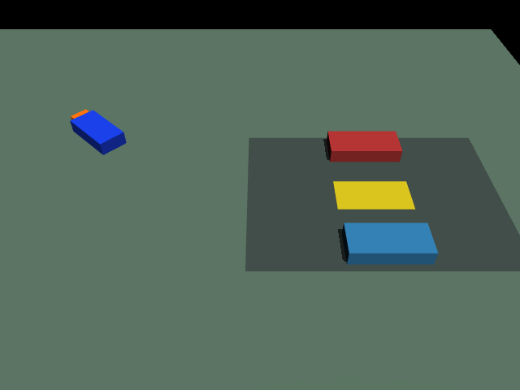
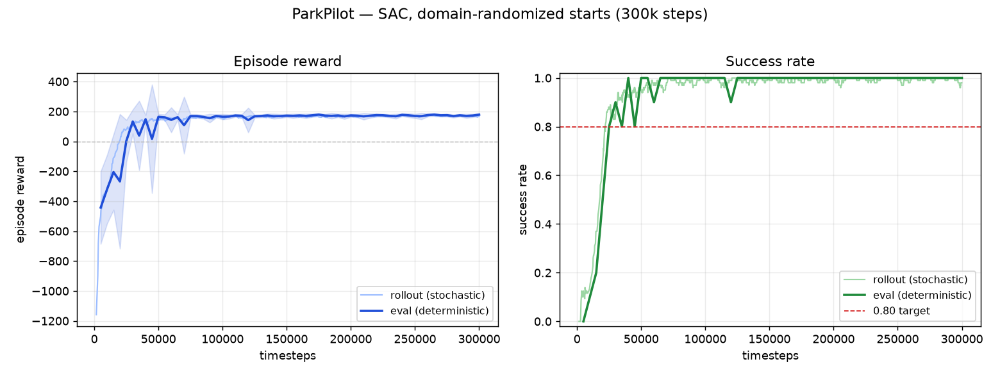

# ParkPilot 🚗

**Reinforcement-learning auto-parking for an Ackermann (car-like) robot, in MuJoCo, running natively on Apple Silicon — no NVIDIA, no Isaac Sim.**

A car learns to drive itself into a tight parking slot wedged between two parked cars, using Soft Actor-Critic (SAC). After domain randomization it parks from essentially *any* starting pose and orientation, choosing forward or reverse maneuvers as needed.



## Results

| Scenario | Success | Notes |
|---|---:|---|
| Fixed start (`0.3, 0, 0`) | **100%** (20/20) | mean reward **+184.6**, parks in **~17 steps** |
| Randomized starts | **99.5%** (398/400, 4 seeds) | 2 collisions, 0 out-of-bounds, 0 timeouts |
| Target (acceptance bar) | ≥80% | comfortably exceeded |



The deterministic eval success rate crosses the 0.80 target around **~30k steps** and saturates near 1.0; episode reward climbs from ~−1180 to a stable **+178** over 300k steps (~15 min on a CPU).

## How it works

- **Dynamics — kinematic bicycle model.** The car pose is integrated in pure Python (`x += v·cosθ·dt`, `y += v·sinθ·dt`, `θ += (v/L)·tanδ·dt`) and written into MuJoCo via `qpos` + `mj_forward` (kinematics/collision only — **not** `mj_step`). MuJoCo provides the scene, rendering, and contact detection; the bicycle model provides the motion. Single source of truth lives in [`parkpilot/car.py`](parkpilot/car.py).
- **Observation** (10-D, float32): car `x, y, sinθ, cosθ`, drive speed, steer angle, and goal-relative `dx, dy, sin(Δθ), cos(Δθ)`.
- **Action** (2-D, ∈[−1,1]): drive velocity ∈ [−2, 2] m/s, steer ∈ [−0.6, 0.6] rad.
- **Reward**: dense penalties on distance-to-goal and heading error + a small time penalty, with large terminal bonuses/penalties for success (+200), collision (−100), and out-of-bounds (−100). Success = within **0.15 m** and **±10°** of the slot.
- **Domain randomization** (Phase 4): rejection-sampled start pose over the whole lot, randomized wheelbase (0.18–0.28 m), and observation noise (σ=0.01). All gated behind a `randomize` flag so `randomize=False` reproduces the fixed-start baseline byte-for-byte.

> **Design note — why friction/mass aren't randomized.** Because the car is purely kinematic (`mj_forward`, not `mj_step`), MuJoCo's dynamics parameters have *zero* effect on motion. Randomizing friction or mass here would be cargo-cult robustness — so the randomization targets the parameters that actually matter: start pose and wheelbase.

## Quickstart

Requires [`uv`](https://docs.astral.sh/uv/) and Python 3.12.

```bash
uv sync                              # install deps into .venv
source .venv/bin/activate

# Evaluate the shipped model (randomized starts, writes eval_rand.gif)
python parkpilot/eval.py --episodes 100

# Evaluate on the fixed start
python parkpilot/eval.py --fixed --episodes 20

# Train from scratch (300k steps, randomized; ~15 min CPU)
python parkpilot/train.py --timesteps 300000

# Regenerate the training-curve figure
python parkpilot/plot_results.py

# Watch live training metrics
tensorboard --logdir runs/
```

## Project layout

```
parkpilot/
  assets/parking.xml   MuJoCo scene: planar car + slot + two parked cars
  car.py               kinematic bicycle model + MuJoCo binding (single source of truth)
  env.py               ParkingEnv (Gymnasium) — obs/action/reward/termination + randomization
  train.py             SAC training (stable-baselines3) + eval/terminal-reason callbacks
  eval.py              deterministic evaluation + GIF capture
  plot_results.py      training curves from TensorBoard logs
  check_env.py         Gymnasium env_checker + collision/episode sanity tests
  drive_test.py        scripted open-loop drive (physics sanity)
  teleop.py            interactive WASD/arrow teleop (needs a display)
models/                trained policies (sac_parking.zip, best_model.zip)
runs/                  TensorBoard logs + eval timeline
```

## Stack

`uv` · Python 3.12 · MuJoCo 3.9 · Gymnasium 1.0 · Stable-Baselines3 (SAC) · PyTorch (CPU) · matplotlib

Built and trained entirely on a MacBook Pro M5 (Apple Silicon) — a portable mirror of proprietary yard-tractor Ackermann work, demonstrating that a credible auto-parking RL loop ships on a laptop with no GPU farm.

## License

MIT
